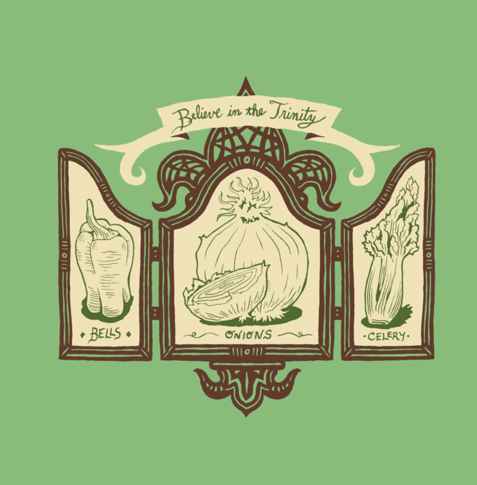

# WIP - New Orleans Recipe Network Viz

Onion, celery, and bell pepper make up the "holy trinity" of Cajun and Creole cooking. In looking at a range of Classic New Orleans recipes, I wanted to see how these, and other ingredients, are paired with one another to create the distinct flavor profiles of Southern Louisiana cooking. 

